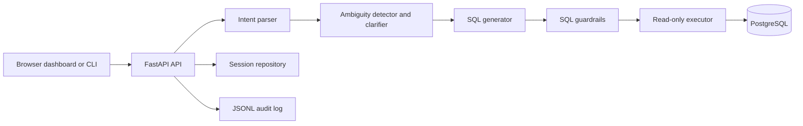
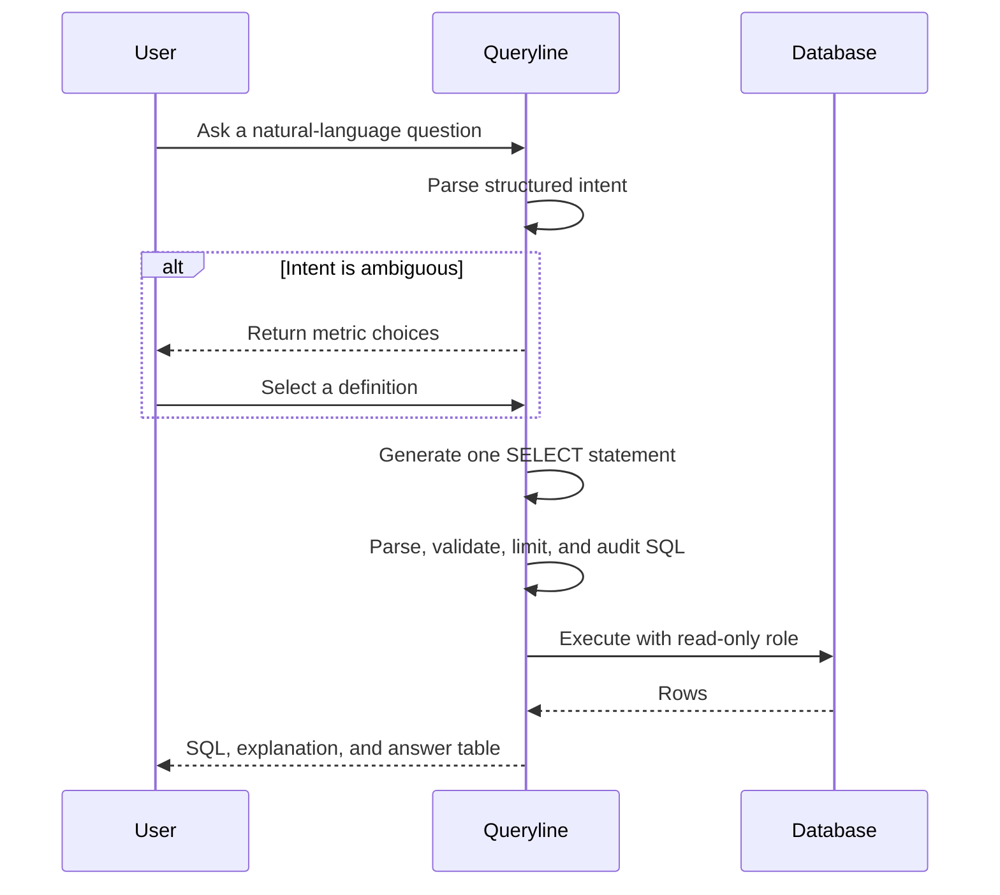

# Queryline

> A clarification-first business intelligence assistant that turns natural-language questions into safe, inspectable PostgreSQL queries.

[](https://github.com/nikithpusarla/text-to-sql/actions/workflows/ci.yml)

## Table of Contents

- [Overview](#overview)
- [Why this project matters](#why-this-project-matters)
- [What problem it solves](#what-problem-it-solves)
- [Architecture](#architecture)
- [Features](#features)
- [Tech stack](#tech-stack)
- [Quick start](#quick-start)
- [Demo flow](#demo-flow)
- [Example prompts and SQL](#example-prompts-and-sql)
- [API](#api)
- [Evaluation](#evaluation)
- [Security and guardrails](#security-and-guardrails)
- [Project structure](#project-structure)
- [Deployment](#deployment)
- [Limitations](#limitations)
- [Roadmap](#roadmap)

## Overview

Queryline is a SaaS-style analytics workspace for teams that need answers from operational data but do not want every question to become a manual SQL task. The system converts a natural-language question into a structured intent, asks for clarification when a business term is underspecified, generates one read-only SQL statement, validates it, and presents the result with the SQL visible for inspection.

The sample workspace models customers, orders, employees, and sales. It runs locally with PostgreSQL and works without an Anthropic key through deterministic fallback parsing and SQL generation.

## Why this project matters

Text-to-SQL is not only a language-generation problem. In a business setting, the difficult failure is often a plausible query that answers the wrong question. Queryline treats ambiguity as a product concern and safety as an execution boundary:

- Business language such as "best customer" is clarified instead of silently guessed.
- Generated SQL is structured, parsed, schema-checked, capped, and executed with a read-only role.
- The answer is explainable because users can inspect the selected definition and generated SQL.
- The offline evaluation harness measures intent, clarification quality, SQL semantics, and safety behavior without fabricating live-model results.

## What problem it solves

A sales or operations stakeholder may ask, "Who is our best customer?" That could mean highest spend, most orders, or most recent activity. A conventional text-to-SQL demo may choose one definition invisibly. Queryline identifies the missing definition and presents the available business metrics before generating SQL. This reduces semantic errors while preserving a fast, natural-language workflow.

## Architecture



### Query workflow



## Features

- Browser dashboard with query composer, examples, clarification cards, SQL preview, and answer table.
- FastAPI endpoints with interactive OpenAPI documentation.
- Anthropic tool-use integration with Pydantic-validated structured output.
- Deterministic offline fallback mode for local demos and tests.
- Glossary-backed ambiguity detection for customer and employee metrics.
- SELECT-only SQL enforcement using `sqlglot`.
- Unknown table and column rejection, comment rejection, system-schema rejection, `pg_sleep` rejection, and query complexity limits.
- Automatic result cap of 100 rows and five-second PostgreSQL statement timeout.
- Read-only PostgreSQL execution role.
- Atomic JSON session persistence for single-instance local deployments.
- JSONL audit events for generated, executed, and rejected SQL.
- Offline evaluation set and metrics runner.
- Docker Compose PostgreSQL sample database.

## Tech stack

- Python 3.11+
- FastAPI and Uvicorn
- Pydantic v2 and pydantic-settings
- PostgreSQL 16, psycopg 3, and Docker Compose
- sqlglot for SQL parsing and validation
- Anthropic Python SDK for optional live structured generation
- pytest for automated tests
- Vanilla HTML, CSS, and JavaScript dashboard

## Quick start

### Prerequisites

- Python 3.11 or newer
- Docker Desktop with the Docker engine running
- An Anthropic API key is optional; fallback mode works without one

### Install and configure

```bash
git clone https://github.com/nikithpusarla/text-to-sql.git
cd text-to-sql
python -m pip install -r requirements.txt
cp .env.example .env
```

On Windows PowerShell, use `Copy-Item .env.example .env` instead of `cp`.

The `.env.example` file documents database, session, complexity, and Anthropic settings. Do not commit `.env`.

### Start PostgreSQL and the API

```bash
docker compose up -d
python -m uvicorn app.main:app --host 127.0.0.1 --port 8000 --reload
```

Open:

- Dashboard: <http://127.0.0.1:8000/>
- API docs: <http://127.0.0.1:8000/docs>
- Health check: <http://127.0.0.1:8000/health>

The first API startup creates missing tables, indexes, and read-only grants when `DATABASE_INIT_ON_STARTUP=true`. It does not reseed or truncate existing data. For production, run migrations as a release step and set that setting to `false` for web workers.

### CLI

```bash
python -m app.cli "Who is our best customer?"
```

The CLI asks clarification questions, validates the generated SQL, executes it, and prints the SQL and returned rows.

## Demo flow

1. Ask `Who is our best customer?`.
2. Queryline detects that "best" is ambiguous and offers total spend, order count, and recency.
3. Select `total_spend`.
4. Queryline generates one PostgreSQL `SELECT` statement.
5. The guardrail layer rejects writes, unknown objects, dangerous functions, comments, cross-schema access, and overly complex queries.
6. The read-only executor runs the statement with a five-second timeout.
7. The dashboard displays the answer table, explanation, selected metric, and generated SQL.

## Example prompts and SQL

These examples describe the deterministic fallback behavior. Live Anthropic output is still validated by the same guardrail layer.

### 1. Best customer by spend

Prompt: `Who is our best customer?`

Clarification: `Total amount spent`

```sql
SELECT customers.name, SUM(orders.total_amount) AS total_spend
FROM customers
JOIN orders ON orders.customer_id = customers.id
GROUP BY customers.id, customers.name
ORDER BY total_spend DESC
LIMIT 100
```

Explanation: ranks customers by the sum of order totals, descending.

### 2. Customer order activity

Prompt: `Who has the most orders?`

Clarification: `Number of orders placed`

```sql
SELECT customers.name, COUNT(orders.id) AS order_count
FROM customers
JOIN orders ON orders.customer_id = customers.id
GROUP BY customers.id, customers.name
ORDER BY order_count DESC
LIMIT 100
```

Explanation: ranks customers by order count, descending.

### 3. Employee performance

Prompt: `Which employee sold the most?`

Clarification: `Number of sales made`

```sql
SELECT employees.name, COUNT(sales.id) AS sales_count
FROM employees
JOIN sales ON sales.employee_id = employees.id
GROUP BY employees.id, employees.name
ORDER BY sales_count DESC
LIMIT 100
```

Explanation: ranks employees by linked sales records, descending.

## API

### `GET /health`

Returns service readiness:

```json
{"status": "ok"}
```

### `POST /query`

Starts or replaces a persisted session.

```json
{"query": "Who is our best customer?"}
```

The response contains a `session_id` and clarification questions, or a guarded SQL result when the intent is already resolved.

### `POST /clarify`

Resolves one slot in a session:

```json
{"session_id": "session-id", "slot_name": "metric", "chosen_value": "total_spend"}
```

### `POST /execute`

Validates and executes a read-only statement:

```json
{"sql": "SELECT name FROM customers"}
```

Rejected SQL returns HTTP 422 with the explicit validation reason. Database failures return HTTP 503 without exposing database internals.

## Evaluation

Run the unit suite:

```bash
python -m pytest -q
```

Run the offline evaluator:

```bash
python tests/run_eval.py
```

The evaluator combines the original ambiguity cases with `tests/evaluation_cases.json` and reports:

- Intent classification accuracy for entity selection.
- Ambiguity precision and recall.
- Clarification candidate recall.
- Average clarification turns.
- Average deterministic parser latency.
- Fallback SQL semantic correctness against resolved intent cases.
- Explicit placeholders for live SQL execution success and unsafe-query rejection, which are verified by integration tests and guardrail tests respectively.

The current offline results are reproducible on this repository. They are not claims about live Anthropic latency or a hosted database.

## Security and guardrails

- Application queries use the configured read-only PostgreSQL role.
- Only one top-level `SELECT` statement is accepted.
- SQL comments are rejected to reduce injection ambiguity.
- `pg_sleep`, system schemas, unknown tables, and unknown columns are rejected.
- Join count, function count, and query length are capped by environment settings.
- Missing limits are capped at 100 rows.
- PostgreSQL `statement_timeout` is set to five seconds per execution.
- Rejected statements are logged with their reason; secrets are not logged by the application.

## Project structure

```text
app/
  main.py                 FastAPI routes and application lifecycle
  cli.py                  Interactive command-line workflow
  config.py               Environment-backed settings
  executor.py             Read-only PostgreSQL execution
  audit.py                JSONL audit events
  schema.py               Local guardrail schema contract
  db/
    connection.py         Application and bootstrap connections
    initialize.py         Idempotent schema and grants initialization
    schema.sql             Tables and indexes
    seed_data.sql          Reproducible local sample data
  engine/
    intent_parser.py      Anthropic and deterministic intent parsing
    ambiguity_detector.py Glossary-backed unresolved-slot detection
    clarifier.py          Human-readable clarification questions
    sql_generator.py      Anthropic and deterministic SQL generation
    guardrails.py         SQL validation and complexity controls
  session/state.py        Atomic local session repository
  static/                 Dashboard assets
  models/                 Pydantic domain contracts
tests/
  test_*.py               Unit and API tests
  eval_set.json           Original ambiguity benchmark
  evaluation_cases.json   Expanded structured benchmark
  run_eval.py             Offline metrics runner
```

## Deployment

The API can be deployed to a Python host such as Railway, Render, Fly.io, or a container platform. PostgreSQL must be external to the web process. Configure all settings through the host secret manager, set `DATABASE_INIT_ON_STARTUP=false` after running schema setup, and use a persistent session backend for multiple instances.

Vercel can host a Python API adapter, but it does not run this repository's Docker PostgreSQL service and its serverless lifecycle is not compatible with process-local state. Use an external PostgreSQL database and replace the local JSON session repository with Redis or PostgreSQL before using multiple serverless instances.

## Limitations

- The local JSON session repository is durable for one instance but is not a distributed session store.
- Authentication, tenant isolation, rate limiting, billing, and audit-log retention are not implemented.
- The sample schema and glossary model one company and a small synthetic dataset.
- Live LLM output quality and latency depend on the configured Anthropic model and are not represented by the offline metrics.
- The test suite does not claim a live Docker database run on every platform; CI validates application behavior and Compose syntax separately from optional database integration.
- A migration tool is not included yet; `schema.sql` is intentionally small and idempotent for this portfolio project.

## Roadmap

1. Replace the JSON session repository with PostgreSQL or Redis and add expiration.
2. Add authentication, organization isolation, rate limiting, and query quotas.
3. Add a migration tool and a dedicated integration-test job with PostgreSQL.
4. Expand semantic evaluation with execution-backed expected result fixtures.
5. Add saved reports, query history, and streaming progress states.
6. Add connectors for Snowflake, BigQuery, MySQL, and SQL Server.

## License

No license has been declared yet. Add a license before redistributing the project.
